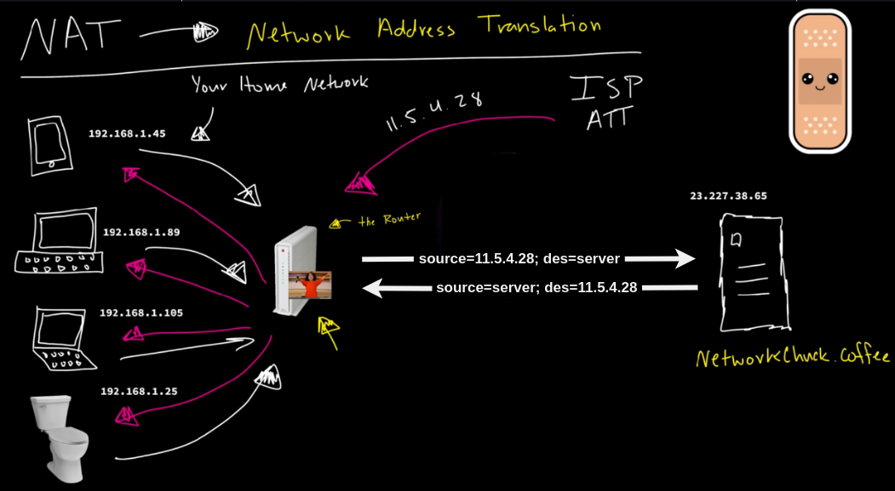

##
- Application: HTTP, FTP, DNS, SNMP, Telnet,...
- Presentation: SSL, TLS,...
- Session Layer: NetBIOS, PPTP,...
- Transport Layer: TCP (Reliable), UDP (FAST),...
- Network Layer: IP, ARP, ICMP, IPSec,...
- Data Link Layer: PPP, ATM, Ethenet,...
- Physical Layer: Ethenet, USB, Bluetooth, IEEE802.11,...

*Note: Depends on Application layer port it can be TCP or UDP (https://en.wikipedia.org/wiki/List_of_TCP_and_UDP_port_numbers)

##
- Switch (L2)
  - Forward data only
  - MAC addresses table (learn and update when hosts talking together using ARP)
- Router (L3)
  - Forward data and modify the `Frame`
  - Routing table (manually configure)

##
- **Johnny** (Find **networkchuck.coffee** MAC using ARP, because **networkchuck.coffee** not in local network, it will get **Router** MAC instead)
  - **Application**: `Data`
  - **Transport**: `TCP`/`UDP`
  - **Network**: `Source IP`-Johnny, `Destination IP`-networkchuck.coffee
  - **Data Link**: `Source MAC`-Johnny, `Destination MAC`-Router (Default Gateway)
  - **Physical**: Send `Data` through the wire

- **Switch** (Get `Data`)
  - Open `Frame` > See `Destination MAC` > Look in its `MAC addresses Table` to find the outgoing ethernet port > Send `Data` to the **Router**

- **Router** (Get `Data`)
  - Open `Frame` and check the `Destination MAC` is for it > Open `Package` and check `Destination IP` > Look in its `Routing Table` to know where it goes next > Find **networkchuck.coffee** MAC using ARP > Put `Package` inside a new `Frame` with `Source MAC`-itself and `Destination MAC`-networkchuck.coffee

*Note: The machanism could be different if the destination host network is not connected with the router. In this case, the router would perform NAT and save mapping in NAT table (host's IP, host's port number - the service sent the request, can be the browser or something), modify the package `Source IP`-Johnny to `Source IP`-Router (router public IP) with a unique port number of the router, then send the package to **networkchuck.coffee**. When getting back the reponse from **networkchuck.coffee** (to router public IP with its unique port number), the router would use NAT and look at NAT table again to determine which host (and its service port) in the local network to forward the message to

- **Switch** (Get `Data`)
  - Open `Frame` > See `Destination MAC` > Look in its `MAC addresses Table` to find the outgoing ethernet port > Send `Data` to the **networkchuck.coffee**

- **networkchuck.coffee**
  - **Physical**: Get `Data`
  - **Data Link**: Open `Frame` and check `Destination MAC`, it's for me
  - **Network**: Open `Package` and check `Destination IP`, it's for me
  - **Transport**: Open `Segment` and check protocol (tcp), and check port (443)
  - **Application**: Open `Data` and check protocol (https) to determine which application will handle next

## Multi-tier network (Switch L3 can be required)

## Data center network (Switch L3 can be required)
- Hosts on these shells could be communicated together through an `Overlay` network, but normally they would communicate with each other through L3 (not L2)

## Vitual Private Network

## DHCP
- Host: 192.168.1.204
- Subnet Mask: 255.255.255.0
- Default Gateway: 192.168.1.1 (router)
- Network: 192.168.1.0 (reserved)
- Broadcast: 192.168.1.255 (reserved)
- Hosts: 192.168.1.2 - 192.168.1.254

## Public IP
- Our computers have 16 million virtual IP addresses ready to respond to itself (funny)

## Private IP
- Took a few chunks from Public IP addresses to make them private

## Network Address Translation (NAT)
- All devices in local network use one public IP address to access the internet (the one assigned to the router, but your router might not have a public IP if it's behide a DNAT network)

## Subneting
### We want ~= 250 hosts
192.168.32.5/24
255.255.255.0

11000000.10101000.00100000.00000101
11111111.11111111.11111111.[00000000] <- Hosts (the more 0, the more hosts)

Hosts: 2^8 = 256 - `subnet address` - `broadcast address` = 254
- `subnet address`: 192.168.32.0
- `broadcast address`: 192.168.32.255

### We want ~= 500 hosts
192.168.32.5/23
255.255.254.0

11000000.10101000.00100000.00000101
11111111.11111111.11111110.00000000

Hosts: 2^9 = 512 - `subnet address` - `broadcast address` = 510
- `subnet address`: 192.168.32.0
- `broadcast address`: 192.168.33.255