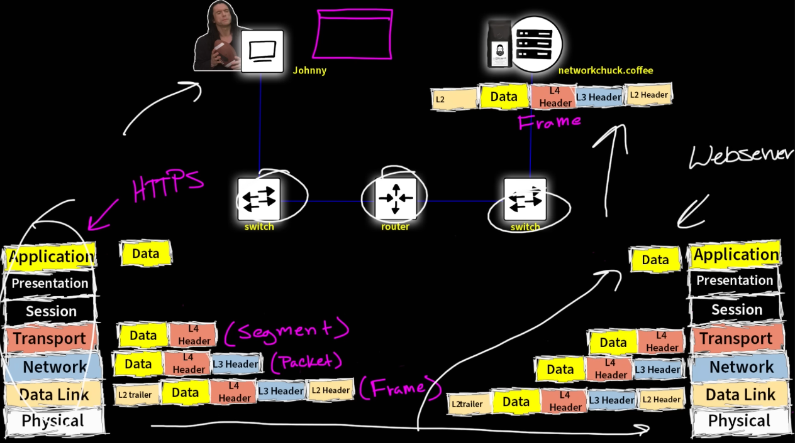
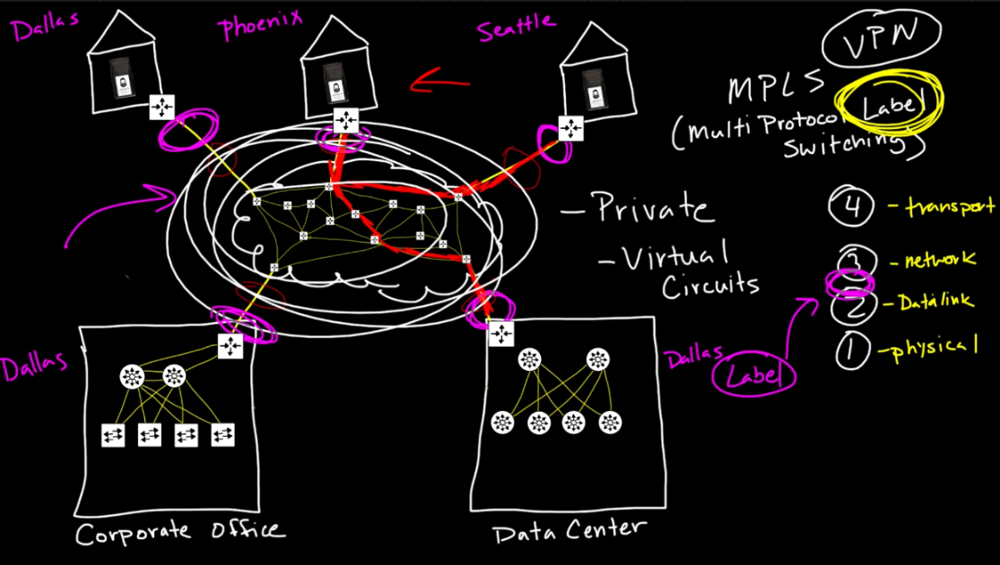

## Flow

  

- **Johnny** (Find **networkchuck.coffee** MAC using ARP, it will get **Router** MAC instead because **networkchuck.coffee** isn't in the local network)
  - **Application**: Prepare `Data`
  - **Transport**: Destination TCP/UDP and Port (put in `Segment`)
  - **Network**: Source IP-Johnny, Destination IP-networkchuck.coffee (put in `Package`)
  - **Data Link**: Source MAC-Johnny, Destination MAC-Router (put int `Frame`)
  - **Physical**: Send Data through the wire

- **Switch** (Get `Data`)
  - Open the `Frame` > See the Destination MAC > Look in its `MAC Addresses Table` to find the outgoing ethernet port > Send `Data` to the Router

- **Router** (Get `Data`)
  - Open the `Frame` and check the Destination MAC (sent to it?) > Open `Package` and check Destination IP > Look in its `Routing Table` to know where it goes next > Find networkchuck.coffee MAC using ARP > Put `Package` inside a new `Frame` with Source MAC-itself and Destination MAC-networkchuck.coffee

- **Switch** (Get `Data`)
  - Open the `Frame` > See Destination MAC > Look in its `MAC Addresses Table` to find the outgoing ethernet port > Send `Data` to the networkchuck.coffee

- **networkchuck.coffee**
  - **Physical**: Get `Data`
  - **Data Link**: Open `Frame` and check Destination MAC (sent to it?)
  - **Network**: Open `Package` and check Destination IP (sent to it?)
  - **Transport**: Open `Segment` and check protocol (TCP/UDP) and Port then forward to approriate service to handle next
  - **Application**: Open `Data` and process it

---
**NOTE**
- The machanism could be different if the destination host network is not connected with the Router. In this case, the Router would perform NAT and save mapping in `NAT Table` (1), modify the package Source IP-Johnny to Source IP-Router (Router's public IP) with a unique port number of the Router, then send the package to **networkchuck.coffee**. When getting back the reponse from **networkchuck.coffee** (to Router's public IP with its unique port number), the Router would use NAT and look at `NAT Table` again to determine which host (and its service port) in the local network to forward the message to

  - (1) Host's IP, host's port number, the service/application sent the request, can be the browser or something, an service/application can open many ports at the same time for outgoing traffic (up to 2^16 per service/application independently in the OS), so it can get it back later in the right port
  - (2) Same with the service/application at a server, like socket webserver, it could keep up to 2^16 ports to clients
---

## OSI
- **Application**: HTTP, FTP, DNS, SNMP, Telnet,...
- **Presentation**: SSL, TLS,...
- **Session**: NetBIOS, PPTP,...
- **Transport**: TCP (Reliable), UDP (FAST),...
- **Network**: IP, ARP, ICMP, IPSec,...
- **Data Link**: PPP, ATM, Ethenet,...
- **Physical**: Ethenet, USB, Bluetooth, IEEE802.11,...

---
**NOTE**
- Depends on Application layer port it can be TCP or UDP (https://en.wikipedia.org/wiki/List_of_TCP_and_UDP_port_numbers)
---

## Devices
- Switch (L2)
  - Look at the **Frame** and forward data only
  - MAC addresses table (learn and update when hosts communicating together using ARP)
- Router (L3)
  - Look at the **Frame** and **Package**, modify the **Frame** and forward data
  - Routing table (manually configure)
- Switch (L3)
  - Combination of Router & Switch (L2)

## DHCP

  

- `Host`: 192.168.1.204
- `Subnet Mask`: 255.255.255.0
- `Default Gateway`: 192.168.1.1 (router)
- `Network`: 192.168.1.0 (reserved)
- `Broadcast`: 192.168.1.255 (reserved)
- `Hosts`: 192.168.1.2 - 192.168.1.254

## Public IP
- Our computers have 16 million virtual IP addresses ready to respond to itself (funny)

  

## Private IP
- Took a few chunks from Public IP addresses to make them private

  

## Network Address Translation (NAT)
- All devices in local network use one public IP address to access the internet (the one assigned to the router, but your router might not have a public IP if it's behide a DNAT network)

  

## Vitual Private Network

  

## Multi-tier network (Switch L3 can be required)

  

## Data Center network (Switch L3 can be required)
- Hosts on these shells could be communicated together through an `Overlay` network, but normally they would communicate with each other through L3 (not L2)

  

