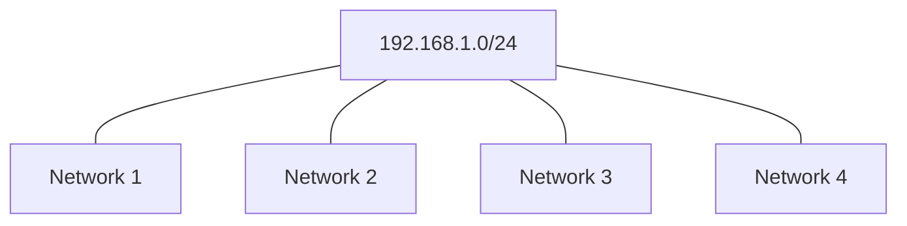
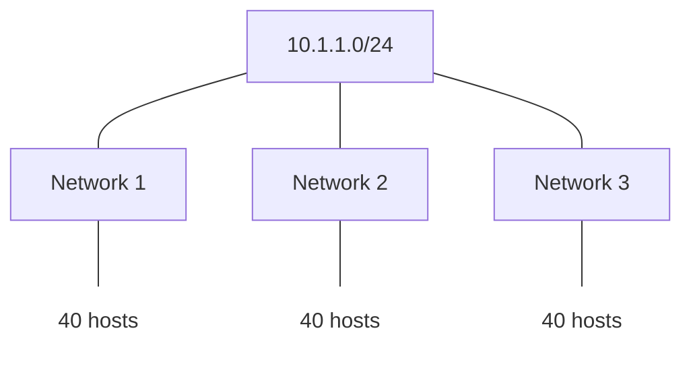
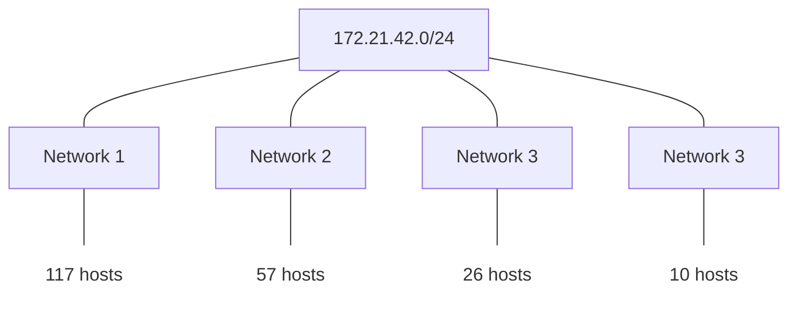
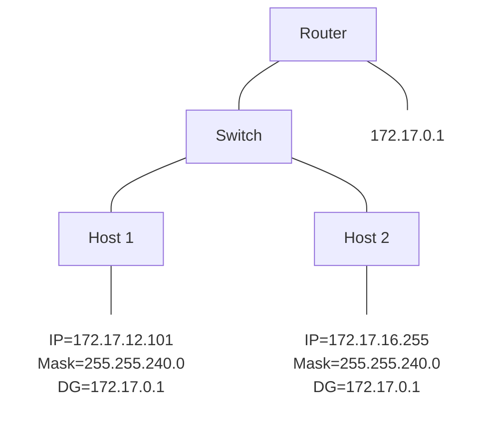

## Subneting
### Subnet mask
```sh
[11111111.11111111.11111111].[00000000]
          network              hosts
```
**(*) Bits Table**
| Layer               | n/h | n/h | n/h | n/h | n/h | n/h | n/h | n/h |
| ------------------- | --- | --- | --- | --- | --- | --- | --- | --- |
| L1 (Bits)           | 8   | 7   | 6   | 5   | 4   | 3   | 2   | 1   |
| L2 (Increment)      | 128 | 64  | 32  | 16  | 8   | 4   | 2   | 1   |
| L3 (Networks/Hosts) | 265 | 128 | 64  | 32  | 16  | 8   | 4   | 2   |

---
**NOTE**
- Hack the bits: Left to Right
- Save the bits: Right to Left
---

### Example
#### We want ~= 250 hosts
192.168.32.5/24
255.255.255.0

11000000.10101000.00100000.00000101
11111111.11111111.11111111.[00000000]

Hosts: 2^8 = 256 - `subnet address` - `broadcast address` = 254
- `subnet address`: 192.168.32.0
- `broadcast address`: 192.168.32.255

#### We want ~= 500 hosts
192.168.32.5/23
255.255.254.0

11000000.10101000.00100000.00000101
11111111.11111111.1111111[0.00000000]

Hosts: 2^9 = 512 - `subnet address` - `broadcast address` = 510
- `subnet address`: 192.168.32.0
- `broadcast address`: 192.168.33.255

#### Create 4 networks


##### 1. Use the Bits Table (*)
- How many networks we want?
  - (L3) 4 networks
  - (L1) 2 bits to hack

##### 2. Hack the bits
- Subnet mask:
  - 11111111.11111111.11111111.00000000
  - 11111111.11111111.11111111.[00]000000
  - 11111111.11111111.11111111.11000000
  - 255.255.255.192 (/26)

##### 3. Find the increment
- The increment:
  - 11111111.11111111.11111111.1[1]000000
  - (L2) The last network bit => 64

##### 4. Create your networks
- 192.168.1.0   => 192.168.1.63  (/26)
- 192.168.1.64  => 192.168.1.127 (/26)
- 192.168.1.128 => 192.168.1.191 (/26)
- 192.168.1.192 => 192.168.1.255 (/26)

#### Create 3 networks (each has 40 hosts)


##### 1. Use the Bits Table (*)
- Find a number that contains 40 hosts?
  - (L3) 64 hosts
  - (L1) 6 bits to save

##### 2. Save the bits
- Subnet mask:
  - 11111111.11111111.11111111.00000000
  - 11111111.11111111.11111111.00[000000]
  - 11111111.11111111.11111111.11000000
  - 255.255.255.192 (/26)

##### 3. Find the increment
- The increment:
  - 11111111.11111111.11111111.1[1]000000
  - (L2) The last network bit => 64

##### 4. Create your networks
- 10.1.1.0   => 10.10.1.63  (/26)
- 10.1.1.64  => 10.10.1.127 (/26)
- 10.1.1.128 => 10.10.1.191 (/26)

#### Create 4 networks (each has different hosts)


---
**NOTE**
- Start from the largest hosts => smallest hosts
---

- Network 1 (start from 172.21.42.0)
  - Hosts:      128 hosts => 7 bits to save
  - Mask:       255.255.255.128 (/25)
  - Increment:  128
  - Range:      172.21.42.0 - 172.21.42.127

- Network 2 (start from 172.21.42.128)
  - Hosts:      64 hosts => 6 bits to save
  - Mask:       255.255.255.192 (/26)
  - Increment:  64
  - Range:      172.21.42.128 - 172.21.42.191

- Network 3 (start from 172.21.42.192)
  - Hosts:      32 hosts => 5 bits to save
  - Mask:       255.255.255.224 (/27)
  - Increment:  32
  - Range:      172.21.42.192 - 172.21.42.223

- Network 4: (start from 172.21.42.224)
  - Hosts:      ...      
  - Mask:       ...
  - Increment:  ...
  - Range:      172.21.42.224 - 172.21.42.239

#### Host1 can't ping Host2



##### 1. Use the Bits Table (*)
##### 2. Hack the bits
##### 3. Find the increment
- 255.255.255.240.0
- 11111111.11111111.111[1]0000.00000000 (/20)
- (L2) The last network bit => 16

##### 4. Create your networks
- 172.17.0.0 - 172.17.15.255
- 172.17.16.0 - 172.17.31.255
- 172.17.32.0 - ...
- 172.17.64.0 - ...

##### 5. Conclusion
- Router IP in same network with Host1
- Host2's default gateway is wrong