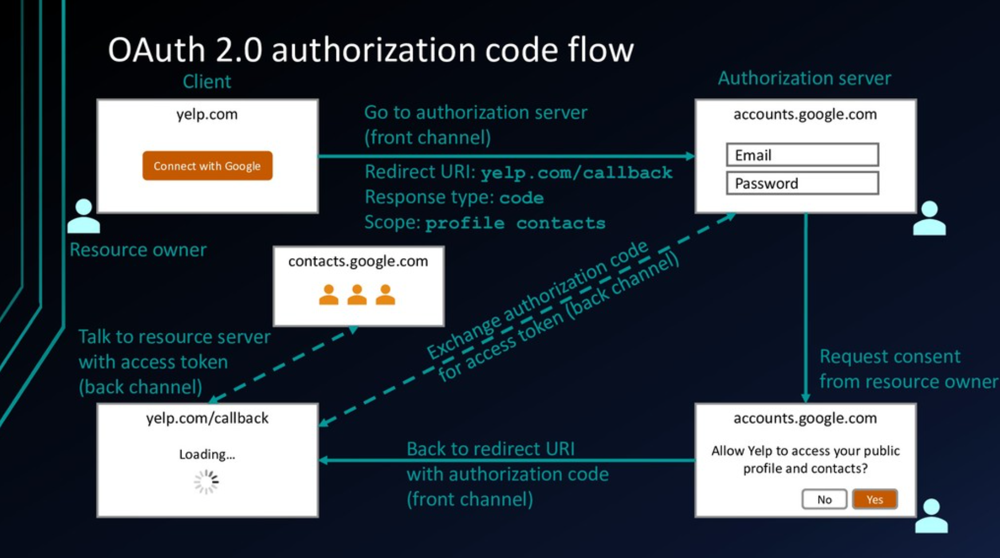
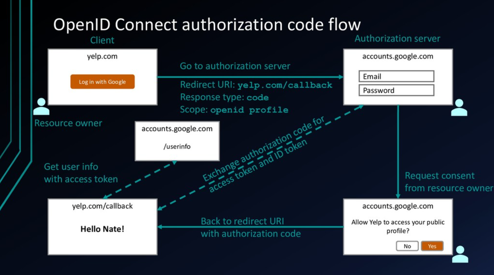

# OAuth 2.0 and OpenID Connect

## Identity use cases (pre-2010)
- Simple login (forms & cookie)
- Single sign-on across sites (SAML)
- Mobile app login (???)
- Deligated authorization (???)

## Identity use cases (pre-2014)
- Simple login (OAuth 2.0)                      - **Authentication**
- Single sign-on across sites (OAuth 2.0)       - **Authentication**
- Mobile app login (OAuth 2.0)                  - **Authentication**
- Deligated authorization (OAuth 2.0)           - **Authorization**

## Identity use cases (today)
- Simple login (OpenID Connect)                 - **Authentication**
- Single sign-on across sites (OpenID Connect)  - **Authentication**
- Mobile app login (OpenID Connect)             - **Authentication**
- Deligated authorization (OAuth 2.0)           - **Authorization**

## When use what
- `OAuth 2.0` for Authorization (**access_token**)
  - Design for permission, scopes (there is no way can get user information) 
  - Granting access to your resource server
  - Getting access to user data in other systems
- `OpenID Connect` Authentication (**id_token**)
  - Design for getting user information (First Name, Last Name, Address, Email,...)
  - Logging the user in
  - Making your accounts available in other systems

## Which flow should I use
- Web application w/ server backend: **Authorization code flow**
- Native mobile app: **Authorization code flow with PKCE**
- JavaScript app (SPA) w/ API backend: **Implicit flow**
- Microservices: **Client credentials flow**

## Token validation
- The fast way (local validation)
  - Check expiration timestamp
  - Validate cryptographic signature
- The strong way (introspection)

## Token revocation
- Need to revoke tokens when they are compromised

## Keep the user signed in
- For both local validation and instropection, the token is invalid once it expires
  - If there is a user at the keyboard, just redirect through the authorization server again
  - If there is no user (automated tasks), request a refresh token (offline scope)

## Channels
### 1. Front channel (not secure)
- Request from a Frontend application (browser) to an resource server

### 2. Back channel (more secure)
- Request from a Backend server to another resource server

## Fun facts
- `scope`: Ask permission included in the access_token to call resource server, UserInfo endpoint (like openid, profile,...)
- `response_type`: Ask what will get from Authorization endpoint and Token endpoint (like authorization_code, id_token, access_token)

## How SSO works (sign-in/sign-out)
- When we go to Website 1 first time > Be redirected to Identity > Sign in Identity with credentials > Identity will save cookie/session in its domain > Then redirect to Website 1 > The user signed-in
- When we go to Website 2 > Be redirect to Identity > Cookie/session within Identity domain sent to the Identity again > The Identity knows the user already signed-in > Redirect the user to Website 2
- Whenever we sign-out at Website 1 or Website 2, it's required to be redirected to Identity to sign-out (clean cookie/session in its domain) to complete signing out the user

## References
- https://oauthdebugger.com (tool)
- https://oidcdebugger.com (tool)
- https://www.youtube.com/watch?v=996OiexHze0&list=WL&ab_channel=OktaDev (video)
- https://speakerdeck.com/nbarbettini/oauth-and-openid-connect-in-plain-english (slide)

## I. OAuth 2.0
### 1. Terminology
- `Resource owner`: The user who clicks the confimation to allow Yelp to access google data, now Yelp can call contacts.google.com resource server
- `Client`: The Yelp application (ClientId, ClientSecret uniquely assigned to the application)
- `Authorization server`: The **accounts.google.com** server
- `Resource server`: The **contacts.google.com** resource server (sometimes Authorization server and Resource server are in the same server but many times they're seperate)
- `Authorization grant`: The whole flow from Client > Authorization server > Back to the Client back and forth (proved that the user clicked yes)
- `Redirect URI`: URL of the client that the Authorization server will redirect back after the user clicked yes
- `Access token`: The Client would need the token to call to **contacts.google.com** resource server
- `Scope`: Basically, the Authorization server will have a list of scopes that it understands like *contacts.read, contacts.write, email.read, email.write,...*, and when the Client kicks off the flow, it needs to request for specific scopes, those scopes requested by the Client will be used to generate the consent screen at level of the Authorization server (if the user confirmed, then later the Client will have the access_token which has valid scopes to call resource server)

### 2. Flows
- **Authorization code** (front channel + back channel | scope=`profile`; response_type=`code`; grant_type=`authorization_code`)
  - The authorization server will respond with a **code**, which the client can exchange for tokens on a secure channel. This flow should be used when the application code runs on a secure server (common for MVC and server-rendered pages apps)
  - Calling endpoints:
    - /authorize  (returns authorization_code)
    - /token      (returns access_token)

- **Implicit** (front channel only | scope=`profile`; response_type=`token`)
  - The authorization server will return an access and/or ID token directly back to the client. This flow is not as secure as the Authorization Code flow, but supports JavaScript single-page applications that need to directly receive tokens (not a secure flow cause all happens at front channel)
  - Calling endpoints:
    - /authorize  (returns access_token)

- **Hybrid** (front channel + back channel | scope=`profile`; response_type=`code`,`token`; grant_type=`authorization_code`) 
  - The authorization server will respond with both a **code** (which the client can exchange for tokens on a secure channel) and an ID token. A common use case for the hybrid flow is using the **code** to get an access token on the server, and directly consuming an ID token on the client
  - Calling endpoints:
    - /authorize  (returns authorization_code)
    - /token      (returns access_token)

- **Client credentials** (back channel only | grant_type=`client_credentials`)
  - Machine to machine communication
  - Calling endpoints:
    - /token      (returns access_token)

- **Resource owner password credentials** (back channel only | grant_type=`password`)
  - Old application integration (not a best practice for new applications)
  - Calling endpoints:
    - /token      (returns access_token)

#### 2.1. Authorization Code


- Get Authoziation Code (front channel request, then back channel will store **authorization_code**)
  - [GET] https://accounts.google.com/oauth2/v1/authorize?client_id=<client_id>&redirect_uri=https://yelp.com/callback&scope=profile&response_type=code
    
- Get access_token (back channel request, then back channel will store **access_token**)
  - [POST] https://accounts.google.com/oauth2/v1/token
    - Content-type: application/x-www-form-urlencoded
      ```
      code: <authorization_code>
      client_id: <client_id>
      client_secret: <client_secret>
      grant_type: authoziration_code
      ```

## II. OpenID Connect
### 1. Terminology (add some more features)
- `ID token`: Have some user information (First Name, Last Name, Address, Email,...)
- `UserInfo endpoint`: For getting more user information (in case ID Token doesn't have enough)

### 2. Flows (has same flows with OAuth 2.0)
- Now we could combine id_token to the response_type in OAuth 2.0 flows (also add **openid** to scope when making request, the purpose of this is to get a valid access_token that can call to UserInfo endpoint)

#### 2.1. Authorization Code
